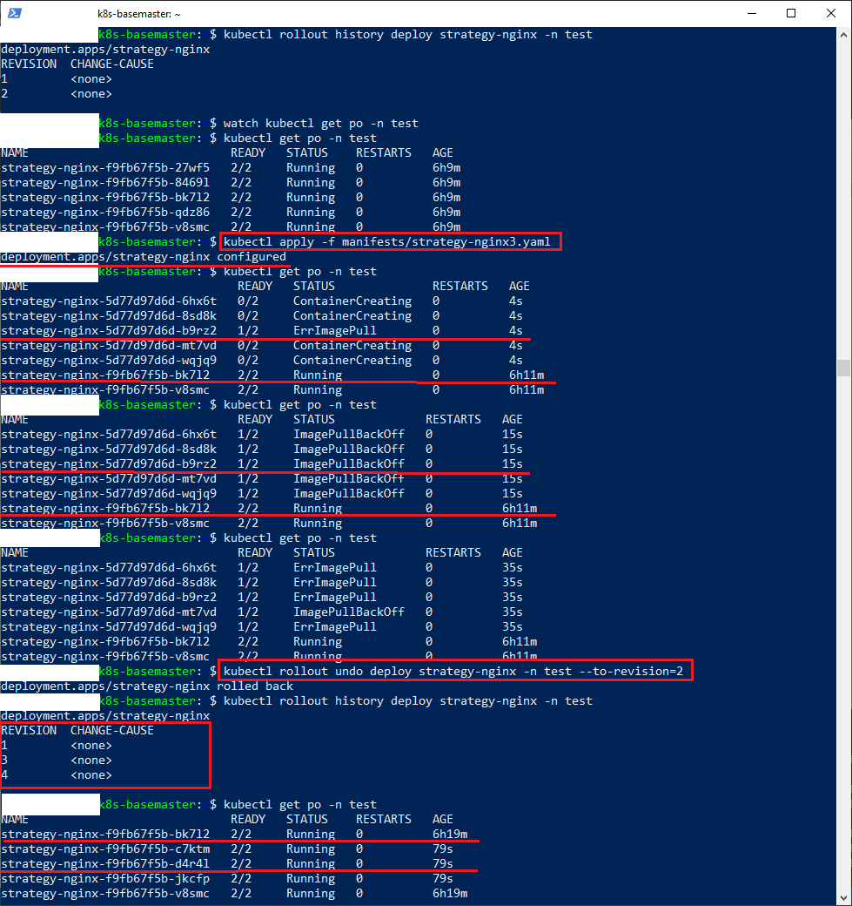

### Задание 1. Выбрать стратегию обновления приложения и описать ваш выбор

1. Имеется приложение, состоящее из нескольких реплик, которое требуется обновить.
2. Ресурсы, выделенные для приложения, ограничены, и нет возможности их увеличить.
3. Запас по ресурсам в менее загруженный момент времени составляет 20%.
4. Обновление мажорное, новые версии приложения не умеют работать со старыми.
5. Вам нужно объяснить свой выбор стратегии обновления приложения.

| Название стратегии       |  Дополнительные необходимые ресурсы | Желательна совместимость версий |
|--------------------------|-------------------------------------|---------------------------------|  
| rollingupdate            |  количество реплик (>= 1 под)       |     Да                          | 
| recreate                 |     0 под                           |     Нет                         |
| blue/green               |   количество реплик (> 1 под)       |     Нет                         |
| канареечное              |     0 под                           |     Да                          |

Из сравнительной таблицы видно что для развертывания несовместимых версий без дополнительных затрат ресурсов подойдет лучше всего стратегия развертывания - **recreate**
Пояснения: 
- Для rollingupdate(постепенного) и канареечного обновления желательная совместимость, т.к. в один момент выполняются обе версии. Соответственно из-за несовместимости могут появится ошибки, например, в БД, которую использует обе версии сервиса. Канареечное обновление просто перенаправляет(обычно не более 15%)  часть обычных пользователей со старой версии на новую.
- Для blue/green необходимо разворачивание дополнительных подов. Каждый сервис использует свое окружение, соответственно совместимость версий некритична. Со старой версией сервиса продолжают работать все пользователи. С новой версией работают QA-инженеры которые проводят тестирование.
 

### Задание 2. Обновить приложение

1. Создать deployment приложения с контейнерами nginx и multitool. Версию nginx взять 1.19. Количество реплик — 5.
2. Обновить версию nginx в приложении до версии 1.20, сократив время обновления до минимума. Приложение должно быть доступно.
3. Попытаться обновить nginx до версии 1.28, приложение должно оставаться доступным.
4. Откатиться после неудачного обновления.

### Решение 2

1. Манифест приложения с версией **nginx:1.19** находится в [файле](manifests/strategy-nginx.yaml)
2. Для уменьшения времени обновления ставим в манифесте значение атрибута **terminationGracePeriodSeconds** равным **0**. В результате не будет ожидания выполнения веб-хуков при останове подов(по умолчанию время равно 30 секундам):
   ```terminationGracePeriodSeconds: 0```
   После развертывания получаем:
   
3. Манифест приложения с версией **nginx:1.20** находится в [файле](manifests/strategy-nginx2.yaml)
   Разворачивание происходит примерно за 21 секунду(на скриншоте видна вторая фаза, когда обновляются оставшиеся 2 пода из 5):
   
   Для получения списка ревизий используем команду:
   ```kubectl rollout history deploy strategy-nginx -n test```
   В результате видим список из двух ревизий:
   
4. Манифест приложения с несуществующей версией **nginx:1.28** находится в [файле](manifests/strategy-nginx3.yaml)
   При попытке разворачивания получаем ошибку **ErrImagePull**. Обновление зависает, ожидая доступности 3 обновляемых подов из 5. Однако, в это время оставшиеся 2 пода продолжают работать на старой версии. Далее производим откат сделанного обновления к рабочей 2 ревизии. В результате она становится 4 ревизией. Откат осуществляем командой:
   ```kubectl rollout undo deploy strategy-nginx -n test --to-revision=2```
   Весь процесс разворачивания ошибочной 3-ей ревизии и отката к ревизии 2 выглядит так:
   


## Дополнительные задания — со звёздочкой*

Задания дополнительные, необязательные к выполнению, они не повлияют на получение зачёта по домашнему заданию. **Но мы настоятельно рекомендуем вам выполнять все задания со звёздочкой.** Это поможет лучше разобраться в материале.   

### Задание 3*. Создать Canary deployment

1. Создать два deployment'а приложения nginx.
2. При помощи разных ConfigMap сделать две версии приложения — веб-страницы.
3. С помощью ingress создать канареечный деплоймент, чтобы можно было часть трафика перебросить на разные версии приложения.

### Решение 3

Управление канареечным развертывание лучше всего осуществлять в service-mesh istio. 
Используя объект **VirtualService**(виртуальный сервис) можно задать проценты от общего трафика направляемого на основную и канареечную версию приложений. 
А используя объект **DestinationRule**(правила) можно связать оба приложения и определить для обоих один виртуальный сервис.
1. Манифест основной версии приложения находится в [файле](manifests/strategy-appv1.yaml)
2. Манифест канареечной версии приложения находится в [файле](manifests/strategy-appv2.yaml)
3. Манифест сервиса находится в [файле](manifests/strategy-service.yaml)
4. Манифест вируального сервиса находится в [файле](manifests/strategy-virtualservice.yaml)
5. Манифест правил маршрутизации находится в [файле](manifests/strategy-destinationrule.yaml)
6. После развертывания всех манифестов запускаем тестовый под:
```kubectl run curl --image curlimages/curl -n test -it --rm -- /bin/sh```
7. отправляем curl-запросы. Видим что один запрос обработан приложением с версией v1(образ nginx версия 1.19), а второй обработан приложением с версией v2(образ nginx версии 1.20)
  


### Установка Istio

Применем способ установки  через helm-чарт 
1. Создаем пространство под компоненты istio:
```kubectl create ns istio-system```
2. Устанавливаем репозиторий чартов istio:
```helm repo add istio https://istio-release.storage.googleapis.com/charts```
3. Устанавливаем определения объектов istio (CRD-пользовательские определения ресурсов):
```helm install istio-base istio/base -n istio-system --set defaultRevision=default```
Ревизия **default** используется для инжектирования sidecar-контейнеров
4. Проверяем, что релиз развернут успешно:
```helm ls -n istio-system```
5. Устанавливаем **istiod**:
``` helm install istiod istio/istiod -n istio-system --atomic```
   Получаем ошибку разворачивания. Чтобы понять в чем была ошибка выполняем команду:
   ```kubectl describe events -n istio-system```
   Получаем список сообщений, которые были сгенерированы в пространстве **istio-system**. Видим что на рабочей ноде не хватает памяти(было только 2 Гб и 2 CPU, а нужно минимум 4 Гб и 4 CPU):
   
   После увеличения памяти и процессоров получаем успешную установку istio в режиме sidecar:
   

6. Чтобы включить sidecar-инжектирование в пространстве(кроме kube-system и istio-system):
```kubectl label namespace test istio-injection=enabled --overwrite```


